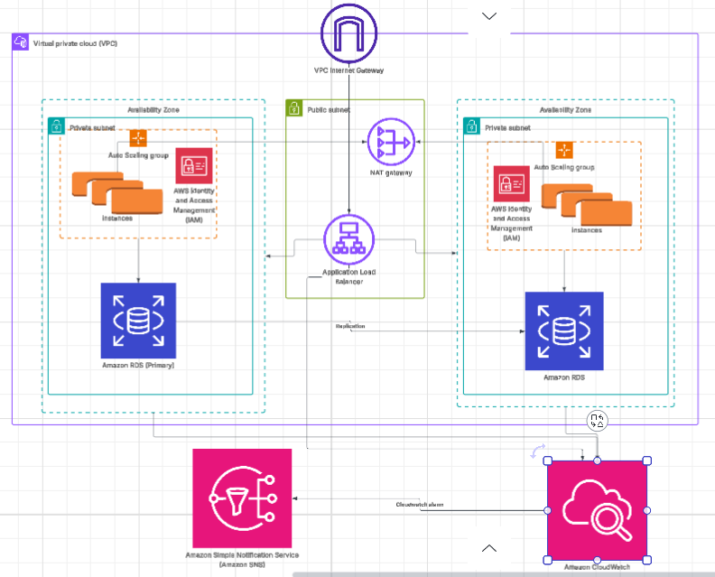

# AWS Scalable Web Application Architecture

[Diagram Link](https://lucid.app/lucidchart/d860f149-462b-4a5c-9c5d-66c245e6dc15/edit?view_items=ne2XcxfFMXDJ&invitationId=inv_e00e326a-51a0-4b94-a4b5-75c1e6e1ea82)

## Overview
This project demonstrates how to deploy a secure, scalable, and highly available web application on AWS using EC2, ALB, and Auto Scaling Groups.

## Key AWS Services
- Amazon EC2
- Elastic Load Balancer (ALB)
- Auto Scaling Group (ASG)
- Amazon RDS (Multi-AZ)
- IAM, CloudWatch, SNS

## Learning Outcomes
- Deploying and scaling EC2-based applications
- Achieving high availability with ALB and ASG
- Monitoring performance and optimizing costs

For full documentation, see [Architecture Documentation](./docs/architecture-documentation.md).
